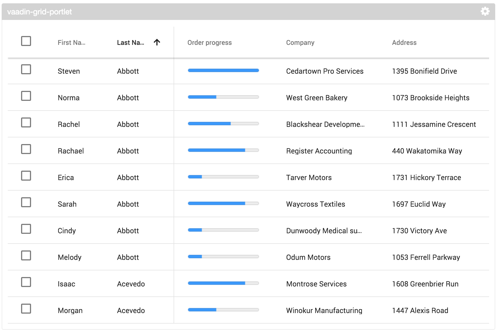

# Portlet with Spring MVC REST API, Spring Data and paging with Vaadin Grid



### How to deploy this portlet to Liferay:

1. Download and run Liferay.

2. Configure Maven properties:
```
liferay.version
liferay.maven.plugin.version
liferay.auto.deploy.dir
liferay.app.server.deploy.dir
liferay.app.server.lib.global.dir
liferay.app.server.portal.dir
```

Example for Liferay 6.2 GA4:
```
<liferay.version>6.2.3</liferay.version>
<liferay.maven.plugin.version>6.2.10.13</liferay.maven.plugin.version>
<liferay.auto.deploy.dir>/data/Java/extensions/liferay-portal-6.2-ce-ga4/deploy</liferay.auto.deploy.dir>
<liferay.app.server.deploy.dir>/data/Java/extensions/liferay-portal-6.2-ce-ga4/tomcat-7.0.42/webapps</liferay.app.server.deploy.dir>
<liferay.app.server.lib.global.dir>/data/Java/extensions/liferay-portal-6.2-ce-ga4/tomcat-7.0.42/lib/ext</liferay.app.server.lib.global.dir>
<liferay.app.server.portal.dir>/data/Java/extensions/liferay-portal-6.2-ce-ga4/tomcat-7.0.42/webapps/ROOT</liferay.app.server.portal.dir>
```

3. Create package and deploy
```
mvn package liferay:deploy
```

If you are interested in doing the same outside of a portlet environment, check out the [Vaadin Grid with paged REST data source](https://github.com/vaadin-marcus/vaadin-grid-rest) demo.